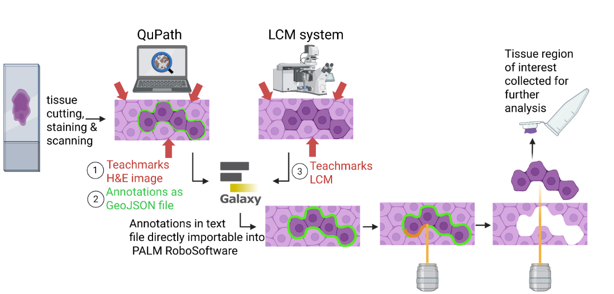
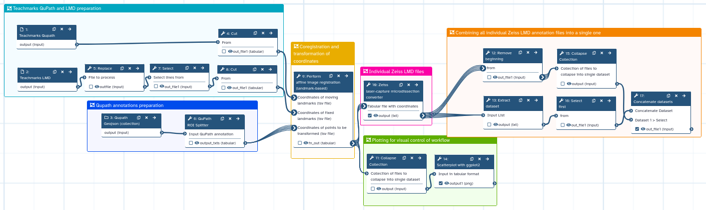

# QuPath_to_LCM
Galaxy workflow for converting QuPath annotations into laser capture microdissection coordinates from Zeiss devices. 

## Overview  
This repository provides a Galaxy workflow to connect [QuPath](https://qupath.github.io/) (for digital pathology annotation) with laser capture microdissection (LCM) systems from Zeiss.  

## Full Workflow  
The diagram below shows the overall experimental workflow:  

  

The tissue is cut into a 5-10µm section and mounted onto PEN glass slides. Staining with hematoxylin or hematoxylin and eosin. Scanning of stained slide with a high resolution (at least 20x) slide scanner. The resulting image is loaded into QuPath. Regions of interest are annotated manually with any QuPath tool or using QuPath machine learning based (semi-)automatic methods. Export the QuPath annotations in GeoJSON format. Use the point annotation option to define at least 3 teachmarks, ideally spanning the entire area with annotations, those can be small well-visible morphological structures. Export the teachmarks as tsv file using `save all` option in the point menu. Insert the stained slide into the LCM device and find the same teachmarks, mark them in the same order as in QuPath with the point tool. Export the LCM teachmarks using `File-export elements-save`. The Galaxy workflow uses the two files with teachmarks coordinates to calculate the coordinate system transformation and applies it to the QuPath annotations and then exports the LCM coordinates in a txt file, which can directly be loaded into Zeiss LCM devices and used for microdissection. 

## Galaxy Workflow  
The individual steps of the Galaxy workflow are illustrated here:  

  

- The workflow file (`QuPath_to_LCM_Galaxy_Workflow.ga`) is included in this repository and can be uploaded into any Galaxy instance.
- For convenience, you can also access it directly via this [Galaxy Workflow link](https://usegalaxy.eu/u/melanie-foell/w/qupath-to-lmd-workflow-direct-teachmark-file-import-and-using-collections).  

### Running the Workflow  
1. Log in to your Galaxy instance.  
   - Don’t have one? You can [register for free at usegalaxy.eu](https://usegalaxy.eu).  
2. Import the workflow:  
   - Either upload the `QuPath_to_LCM_Galaxy_Workflow.ga` file from this repository.  
   - Or import it directly using the shared Galaxy link above.  
3. Inputs for the workflow:
  - teachmark coordinates from QuPath (tsv file exported via the point annotation menu)
  - teachmark coordinates from LCM device
  -
  - tex and y coordinates as 2 column tabular file with a header line x and y containing at least three teachmark coordinates from physical slide in LCM device, the teachmarks have to be in the same order as in the first file
  - QuPath annotations as GeoJSON file
5. Run the workflow to generate a text file containing the annotations as txt file, that can directly be uploaded into Zeiss PALM RoboSoftware. An additional scatterplot showing the coordinates of the annotations is generated for visual control. 

## Citation  
If you use this workflow in your research, please cite this repository, a preprint manuscript will follow soon. 
